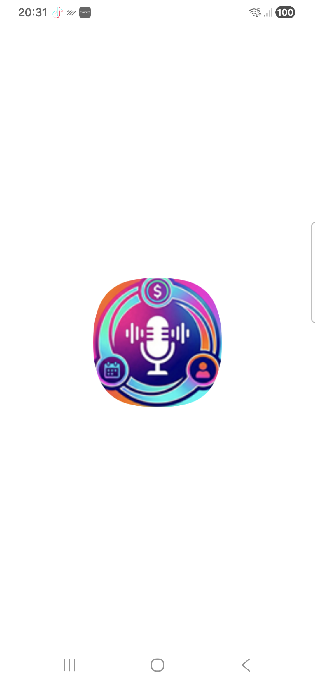

# 🎤 FinAgeVoz

**FinAgeVoz** é um aplicativo Flutter multiplataforma que combina **gestão financeira** e **agenda de eventos** com controle por **comandos de voz** e **inteligência artificial**.


## ✨ Principais Funcionalidades

### 🎤 Controle por Voz
- **Comandos de voz em linguagem natural** usando IA (Groq/Llama)
- **14 idiomas suportados** com reconhecimento e síntese de voz
- **Palavra de ativação personalizável**
- Exemplos de comandos:
  - "Comprei um café de 5 reais"
  - "Criar evento reunião amanhã às 14h"
  - "Quanto gastei este mês?"


### 💰 Gestão Financeira
- ✅ **Pagamentos e Recebimentos**: Controle total de fluxo de caixa. O sistema diferencia automaticamente lançamentos **Realizados (Pagos)** de **Futuros (Pendentes)**.
- ✅ **Parcelamento Inteligente**: Ao lançar uma compra parcelada, o app gera todas as parcelas futuras como "Pendentes", permitindo baixa manual mês a mês.
- ✅ **Relatórios Completos**: Gráficos de categorias, evolução de gastos e exportação para PDF.

### 🎂 Aniversários e Mensagens IA
- ✅ **Cadastro Eterno**: Registre a data uma vez e o sistema lembrará para sempre.
- ✅ **Mensagens Geradas por IA**: Informe o **grau de parentesco** (Mãe, Cliente, Amigo) e a IA escreverá uma mensagem personalizada e adequada para a ocasião.
- ✅ **Envio Direto**: Envie a mensagem gerada via **WhatsApp**, **SMS** ou **E-mail** sem sair do app.

### 💊 Gestão de Saúde e Medicamentos
- ✅ **Cadastro Detalhado**: Nome, dosagem, forma farmacêutica e finalidade.
- ✅ **Posologia Flexível**: Configure intervalos (ex: a cada 8 horas), horários fixos ou uso contínuo.
- ✅ **Controle de Estoque**: O sistema alerta quando o remédio está acabando.
- ✅ **Histórico de Tomada**: Marque cada dose como tomada para manter um registro de aderência ao tratamento.
- ✅ **Anexos**: Guarde fotos de receitas e bulas junto ao medicamento.

### 📅 Agenda de Eventos
- ✅ Criação rápida de compromissos por voz.
- ✅ Eventos recorrentes (Diário, Semanal, Mensal, Anual).
- ✅ Notificações faladas: O app anuncia sua agenda do dia ao abrir.


### 🤖 Inteligência Artificial
- ✅ Processamento de linguagem natural com **Groq (Llama 3.3)**
- ✅ Respostas inteligentes a perguntas financeiras
- ✅ Extração automática de dados (valores, datas, categorias)
- ✅ Suporte a múltiplos idiomas

### 📊 Relatórios e Análises
- ✅ Gráficos de pizza por categoria
- ✅ Resumo financeiro (receitas, despesas, saldo)
- ✅ Relatório dedicado de parcelamentos
- ✅ Filtros avançados personalizáveis
- ✅ Exportação em PDF
- ✅ Compartilhamento via WhatsApp

### 💾 Backup e Sincronização
- ✅ Backup local em JSON
- ✅ Backup no Google Drive
- ✅ Importação/Exportação de dados
- ✅ Limpeza automática de dados antigos

### 🌍 Multilíngue
Suporte completo a **14 idiomas**:
- 🇧🇷 Português (Brasil/Portugal)
- 🇺🇸 English
- 🇪🇸 Español
- 🇩🇪 Deutsch
- 🇮🇹 Italiano
- 🇫🇷 Français
- 🇯🇵 日本語
- 🇨🇳 中文
- 🇮🇳 हिन्दी
- 🇸🇦 العربية
- 🇮🇩 Bahasa Indonesia
- 🇷🇺 Русский
- 🇧🇩 বাংলা

## 🚀 Como Usar

### Pré-requisitos
- Flutter SDK (versão 3.0+)
- Dart SDK
- Android Studio / Xcode (para builds mobile)
- Chave API do Groq (gratuita em [console.groq.com](https://console.groq.com))

### Instalação

1. **Clone o repositório**
```bash
git clone https://github.com/abreuretto72/FinAgeVoz.git
cd FinAgeVoz
```

2. **Instale as dependências**
```bash
flutter pub get
```

3. **Configure a API Key (opcional para desenvolvimento)**
Crie um arquivo `.env` na raiz do projeto:
```env
GEMINI_API_KEY=sua_chave_gemini_aqui
```
> **Nota**: Em produção, configure a chave Groq diretamente no app (Menu → Configurações → Chave Groq API)

4. **Execute o app**
```bash
flutter run
```

### Build para Produção

**Android (APK):**
```bash
flutter build apk --release
```
ou use o script:
```bash
./build_apk.sh  # Linux/Mac
./build_apk.ps1 # Windows
```

**iOS:**
```bash
flutter build ios --release
```

## 📖 Documentação

- **[FUNCIONALIDADES.md](FUNCIONALIDADES.md)** - Documentação completa de todas as funcionalidades
- **[BUILD_INSTRUCTIONS.md](BUILD_INSTRUCTIONS.md)** - Instruções detalhadas de build
- **[TRANSLATION_GUIDE.md](TRANSLATION_GUIDE.md)** - Guia para adicionar traduções
- **[walkthrough.md](walkthrough.md)** - Histórico de desenvolvimento

## 🛠️ Tecnologias Utilizadas

- **[Flutter](https://flutter.dev/)** - Framework multiplataforma
- **[Hive](https://pub.dev/packages/hive)** - Banco de dados NoSQL local
- **[Groq API](https://groq.com/)** - Inteligência artificial (Llama 3.3)
- **[Speech-to-Text](https://pub.dev/packages/speech_to_text)** - Reconhecimento de voz
- **[Flutter TTS](https://pub.dev/packages/flutter_tts)** - Síntese de voz
- **[FL Chart](https://pub.dev/packages/fl_chart)** - Gráficos
- **[PDF](https://pub.dev/packages/pdf)** - Geração de relatórios

## 📱 Screenshots

<p align="center">
  
</p>

## 🎯 Casos de Uso

### Exemplo 1: Adicionar Transação por Voz
```
👤 Usuário: "Comprei um café de 5 reais"
🤖 App: "Transação adicionada: Café, R$ 5,00 em Alimentação"
```

### Exemplo 2: Criar Evento Recorrente
```
👤 Usuário: "Criar evento reunião toda segunda às 14h"
🤖 App: "Evento criado: Reunião (Semanal)"
```

### Exemplo 3: Consulta Financeira
```
👤 Usuário: "Quanto gastei em alimentação este mês?"
🤖 App: "Você gastou R$ 450,00 em Alimentação este mês"
```


## 🤝 Contribuindo

Contribuições são bem-vindas! Sinta-se à vontade para:
- Reportar bugs
- Sugerir novas funcionalidades
- Enviar pull requests
- Melhorar a documentação
- Adicionar traduções

## 📄 Licença

Este projeto está sob a licença MIT. Veja o arquivo [LICENSE](LICENSE) para mais detalhes.

## 👨‍💻 Autor

**Abreu Retto**
- GitHub: [@abreuretto72](https://github.com/abreuretto72)

## 🙏 Agradecimentos

- [Flutter Team](https://flutter.dev/) pelo framework incrível
- [Groq](https://groq.com/) pela API de IA gratuita
- Comunidade Flutter pelo suporte

## 📊 Estatísticas do Projeto

- **Linhas de código**: ~15.000+
- **Telas**: 10
- **Serviços**: 9
- **Idiomas**: 14
- **Comandos de voz**: 20+
- **Categorias padrão**: 18

## 🔮 Roadmap

- [ ] Modo offline completo para IA
- [ ] Widget para tela inicial do Android
- [ ] Sincronização entre dispositivos
- [ ] Análise preditiva de gastos
- [ ] Metas financeiras
- [ ] Lembretes de pagamentos
- [ ] Integração com bancos (Open Banking)

---

**Desenvolvido com Flutter 💙**

Se este projeto foi útil para você, considere dar uma ⭐!
